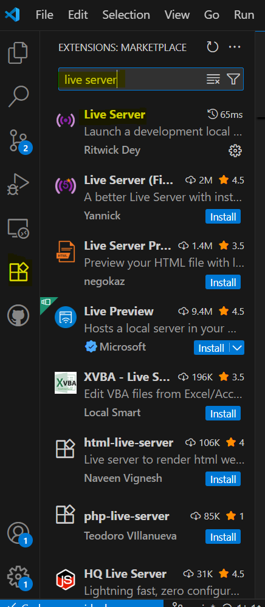
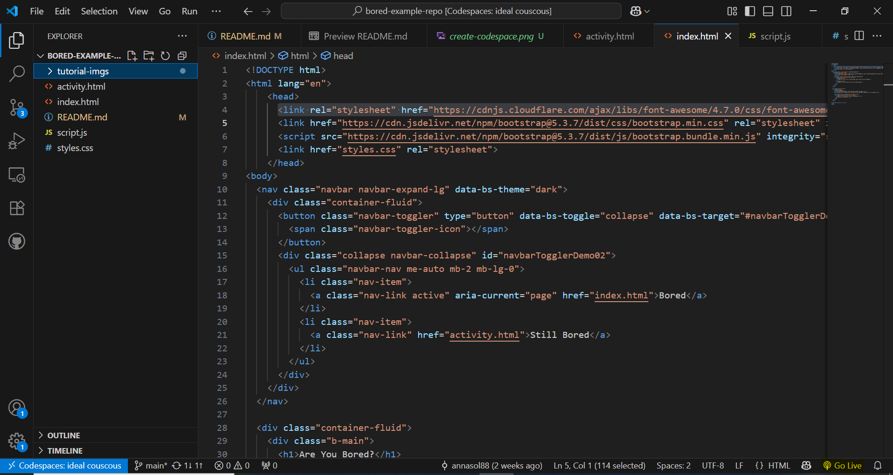

# Create your own bored app
This tutorial will walk you through how to create your own bored app!
This will teach you all the key concepts you need to understand for basic web development, and more importantly your hackathon!

## Create Github account 
First things first, you will need to log into Github. if you don't already have an account, you will need to create one. To do so:

- Navigate to [github.com](https://github.com/). 
- Press Sign up
- Follow the prompts to create your account **make sure you use an email that you have access to because you will need to verify your account.*

## Get familiar with GitHub

GitHub is a really powerful platform used for software collaboration and version control. (it does more than just this)

Yoiu will need to have a good understanding of how it works ahead of your hackathon, so lets do a wee deep dive.

- Follow [this tutorial](https://docs.github.com/en/get-started/start-your-journey/hello-world) to learn about key github concepts.

## Lets start coding 

To start coding our bored project you will need to first:
- Create a new repository, which you should know how to do from the last tutorial.

then to make changes we will use another github feature called code spaces, since we will want to edit mutliple files at a time.

To do this: 
- Click on `<> code` -> `codespace` -> `+` as shown in the image

- This should open in a new tab for you immediately, but if not you should be able to find your codespace listed under `<> code` -> `codespace`, mine is called `ideal couscous` as you can see in the image above.

Your codespace will allow you to make changes through visual studio code (VSC). This a text editor/ IDE for code - just like microsoft word for editing documents VSC is for editing code. 

You can see more details about features of VSC on page 17 of your hanbook if you are interested!

## Create Web page with static content - HTML
HTML is a markup language used for all webpages so lets see it in practice:
- Create a file called `index.html`
- Copy the following code snippet into your index.html
```html
<html lang="en">
<head>
  <meta charset="UTF-8" />
  <title>My Bored App</title>
</head>
<body>
    <!-- It is tradition to make your code say hello world in every new programming languge you learn -->
    <h1>Hello World!</h1>
</body>
</html>
```

This code will become a webpage that says hello to the world. Now we need to 'serve' it, this means we need to put this code through an interpretter to give us the output that we want.

While you can interpret static HTML by opening the file in your browser directly, we are going to use a live server plugin that does the interpretting for us and detects real time updates, this will be important as we add more things to our site.

to install our plugin we will need to:

- In our VSC codespace, click the extention icon in the left hand menu -> search for 'live server' then press install.

- Once installed you should see an option saying go live in the bottom left.

- If it does not appear you may need to close and open your code space to allow VSC to refresh itself.

Clicking on this should open a browser where we can see our hello world website.

Notice that URL is `127.0.0.1:5500`. This 127.0.0.1 is called a loopback IP address which means this webpage is running on your local machine not the internet! 

Congrats!!! You have now created your fisrt HTML page. Now lets add more to it.

Now, using [this cheetsheet](https://www.shecodes.io/cheatsheets/html) to help you, can you do the following:
- Update the heading from 'Hello World!' to 'Are You Bored?'
- Add a button that says 'I'm bored'.
- Add a paragraph that encourages the user to click on the button.

Don't worry about this not looking great, we will fix that in the next step.

## Style our webpage - CSS
CSS is a style sheet language which allows us to selectively style HTML elements. To add CSS to our codebase we will need to do the following:
- Create a file called `styles.css`
- Add a link to the `<head>` of our html like so:
```diff
...
<head>
  <meta charset="UTF-8" />
  <title>My Bored App</title>
+ <link href="styles.css" rel="stylesheet">
</head>
...
```
- Then add the following styles to your CSS:
```css
body {
    /* add some colour using hex colour codes */
    color: #444444;
    background-color: #EFEFEF;
}
```

When using styles it is best practice to refer to our HTML elements using classes so that we can make styles as granular or reusable as we want. For example.

- Lets wrap all the content in our page currently with a `<div>` or a `<main>` tag then add a class to it called `main-content`:
```html
<body>
    <main class="main-content">
    ... <!-- your code is here -->
    </main>
<body>
```

- In our style.css lets add the following block:
```css
.main-content {
    /* position our content center with flex box*/
    display: flex;
    flex-direction: column;
    justify-self: center;
    text-align: center;
    /* add some spacing around */
    padding: 2rem;
    gap: 1rem;
}
```

Notice that when we reference classes in out CSS we must use a `.` prefixing the name

- Now, Open your live serve again and lets see what has changed!

Our Webpage is looking much better already!!!

Now, lets do some more styling using [this CSS cheetsheet](https://www.shecodes.io/cheatsheets/css) to help you, lets try to:
- Add some differnt fonts/ text colors / text sizes 
- Style our button to look like the one in the example. The hex for the colour used is: `#006652`, but feel free to mess around and choose your own colours and styles.

## More styling - Bootstrap
As we've seen, using CSS can be fiddly and repetative sometimes, and becomes more and more difficult to maintain as applications grow.

One solution to save time writing your css is to use a third-party, open-source framework such as [Bootstrap](https://getbootstrap.com/).
Bootstrap provides a library of pre-designed components and styles that we can plug into our app, so lets try it out.

- First, we need to add the bootstrap style sheet and javascript to our index.html:
```diff
...
<head>
  <meta charset="UTF-8" />
  <title>My Bored App</title>
+ <link href="https://cdn.jsdelivr.net/npm/bootstrap@5.3.7/dist/css/bootstrap.min.css" rel="stylesheet" integrity="sha384-LN+7fdVzj6u52u30Kp6M/trliBMCMKTyK833zpbD+pXdCLuTusPj697FH4R/5mcr" crossorigin="anonymous">
+ <script src="https://cdn.jsdelivr.net/npm/bootstrap@5.3.7/dist/js/bootstrap.bundle.min.js" integrity="sha384-ndDqU0Gzau9qJ1lfW4pNLlhNTkCfHzAVBReH9diLvGRem5+R9g2FzA8ZGN954O5Q" crossorigin="anonymous"></script>
  <link href="styles.css" rel="stylesheet">
</head>
...
```
Pay attention to the order of your links because this matters for CSS. If you want your stylesheets to take presedence over bootstrap (which we often do because we may choose to override some classes) we need those stylesheets to be listed last.

Lets have a look at styling some buttons with bootstrap [here](https://getbootstrap.com/docs/5.3/components/buttons/)

As you can see from the documentation, bootstrap exposes a set of classes for different button style variations, so lets see how this work. 

- Try adding the `btn-primary` class (or another of your choice) to your bored button and see what happens. It should look something like this:
```html
<button type="button" class="btn btn-primary">I'm Bored</button>
```

Great! we've created a beautifully styled button in seconds! thats probably saved us 10-20 lines of coding ourselves!

- Now, have a play about with the other class modifiers available on that page to see the different things we can do to our buttons.

But there aren't a lot of colour options, what if we want different ones? Well Bootstrap supports this too. In web development its common for a site to have 2-3 main branding colours which we call 'primary', 'secondary' & 'tertiary' and also status colour like 'success', 'error' etc. which is what bootstrap button classes refer too. 

These classes are written using CSS variables which means they can be customized by changing the variable values.

So lets obverride these variables with our own branding colours.

- In your styles.css add a class for the primary button and replace your colour varaibles. You will need the !important flag to make sure your overrides take presidence over the default styles:
```css
.btn-primary {
    --bs-btn-color: #fff !important;
    --bs-btn-bg: #006652 !important;
    --bs-btn-border-color: #006652 !important;
    --bs-btn-hover-color: #fff !important;
    --bs-btn-hover-bg: #003d31 !important;
    --bs-btn-hover-border-color: #003d31 !important;
    --bs-btn-active-color: var(--bs-btn-hover-color)!important;
    --bs-btn-active-bg: #003d31 !important;
    --bs-btn-active-border-color: #003d31 !important;
}
```

https://getbootstrap.com/docs/5.3/components/buttons/#variables


 

## Add functionality to our webpage - Javascript

Javascript is the foundation for adding any functionality or interactivity to any webpage. so lets create a basic show hide functionality!

- show hide functionality
- lets get creative 

## Lets add some data - API's


## Git Commit


## Extension:
- complete the activities page 

- hookup another API
- responsiveness
- font awesome